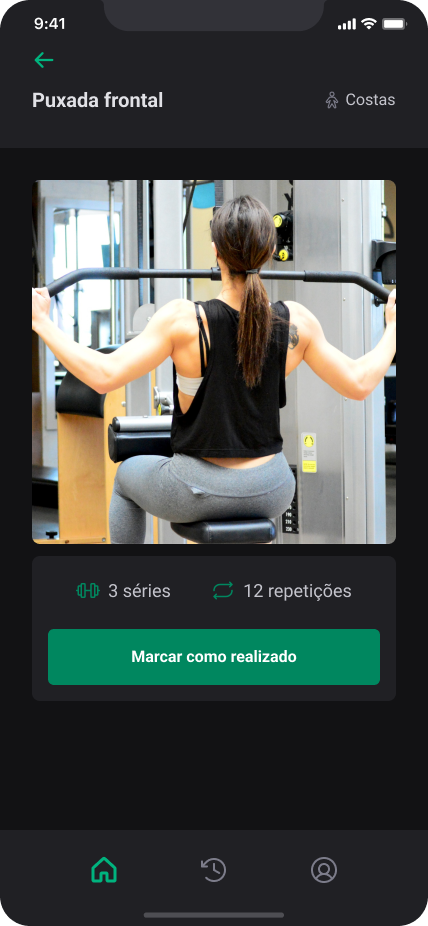
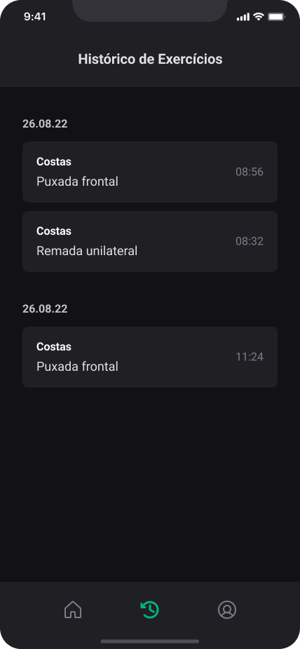

# Ignite Gym

Aplicativo mobile desenvolvido com React Native e Expo, focado em gerenciamento de treinos em academias.

<!-- ## 🚀 Tecnologias utilizadas

- **Expo**
- **TypeScript**
- **React Native**
- **Native Base**
- **Axios**
- **Yup**
- **React Hook Form**
- **React Navigation** -->

## 🔧 Tecnologias Utilizadas

### 📱 Frontend (React Native + Expo)
- [React Native](https://reactnative.dev/)
- [Expo](https://expo.dev/)
- [TypeScript](https://www.typescriptlang.org/)
- [React Navigation](https://reactnavigation.org/)
- [React Hook Form](https://react-hook-form.com/)
- [Yup](https://github.com/jquense/yup)
- [Axios](https://axios-http.com/)
- [Native Base](https://nativebase.io/)
- [AsyncStorage](https://react-native-async-storage.github.io/async-storage/)
- [@react-native-community/netinfo](https://github.com/react-native-netinfo/react-native-netinfo)
- [Phosphor Icons](https://phosphoricons.com/)

### 🌐 Backend
- [Fastify](https://www.fastify.io/)
- [Prisma ORM](https://www.prisma.io/)
- [SQLite](https://www.sqlite.org/)
- [Zod](https://zod.dev/)

---

## 📱 Funcionalidades

- ✅ Autenticação de usuários (login e cadastro)
- 📋 Visualização de grupos musculares
- 🏋️‍♂️ Listagem de exercícios por grupo
- 🔍 Detalhes dos exercícios com vídeo demonstrativo
- 📝 Registro e histórico de treinos realizados
- 👤 Perfil do usuário com opções de edição

## 📷 Capturas de Tela

<!-- > **Dica:** Para adicionar suas capturas de tela, salve as imagens em uma pasta (por exemplo, `assets/`) e insira os links abaixo. -->

| Tela de Login | Tela de Exercícios | Tela de Detalhes |
|---------------|--------------------|------------------|
|  |  |  |

## 🔧 Instalação

Clone o repositório e instale as dependências:

```bash
npx create-expo-app@latest
npm install
